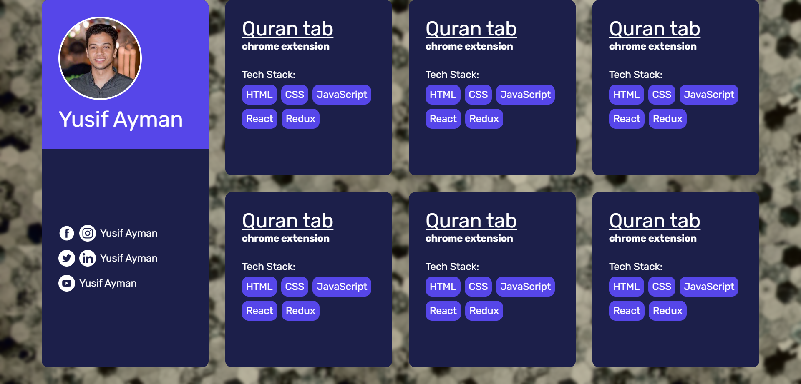

# Project Track Board

This is a simple project track board created using HTML and CSS. It showcases different projects with their respective tech stacks in a visually appealing manner.

## Table of Contents

- [Overview](#overview)
- [Features](#features)
- [Tech Stack](#tech-stack)
- [Getting Started](#getting-started)
- [Usage](#usage)
- [Contributing](#contributing)
- [Contact](#contact)

## Overview

The Project Track Board is designed to display various projects along with their tech stacks in a clean and organized layout. It includes a user profile section and multiple project cards.

## Features

- User profile section with social media links
- Project cards displaying the project title, description, and tech stack
- Responsive design for different screen sizes

## Tech Stack

The project is built using the following technologies:

- HTML
- CSS
- Flexbox
- CSS Grid

### Screenshot



### Links

- Live Site URL: [Personal Track Board](https://yussif20.github.io/personal__track__dashboard/)

## Getting Started

To get a local copy up and running, follow these steps:

1. Clone the repository:

   ```bash
   git clone https://github.com/Yussif20/personal__track__dashboard
   ```

2. Navigate to the project directory:

   ```bash
   cd personal__track__dashboard
   ```

3. Open the `index.html` file in your browser to view the project.

## Usage

- The left sidebar displays the user's profile picture, name, and social media links.
- The main section contains multiple project cards, each showing the project title, description, and tech stack.

## Contributing

Contributions are welcome! If you have any ideas or improvements, feel free to open an issue or submit a pull request.

1. Fork the Project
2. Create your Feature Branch (`git checkout -b feature/AmazingFeature`)
3. Commit your Changes (`git commit -m 'Add some AmazingFeature'`)
4. Push to the Branch (`git push origin feature/AmazingFeature`)
5. Open a Pull Request

## Contact

- Website - [Yusif Ayman](https://yussif20.github.io/main-portfolio/)
- linkedin - [Yusif Ayman](https://www.linkedin.com/in/yussif-ayman/)
- Github - [Yusif Ayman](https://github.com/Yussif20)
